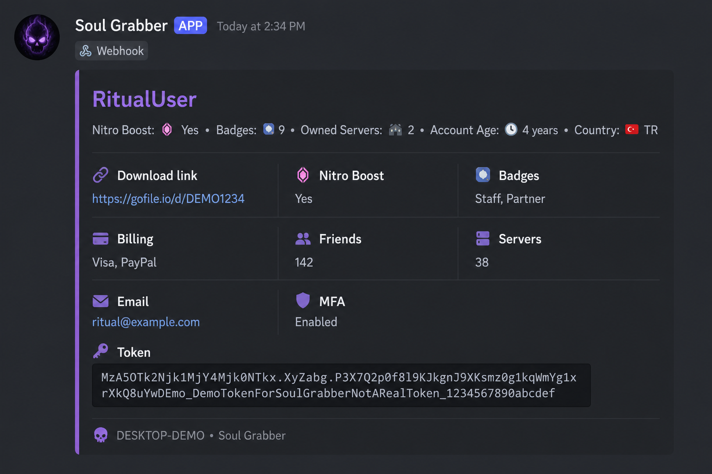

# Soul Grabber

**Discord intelligence ù Chromium v20 capture ù Webhook delivery**

[Join Discord](https://discord.gg/soulgrab) ù [Disclaimer](./DISCLAIMER.md)

---

> ?? **Educational purposes only.** No source code or binaries in this repository.  
> Unauthorized use is illegal. Read [DISCLAIMER.md](./DISCLAIMER.md).

---

## Soul Grabber

Modern stealer research stack: **Discord account embeds**, **Chromium App-Bound (v20) cookies**, dual webhook patterns, standalone **EXE** + **Fabric JAR** builds, and cookie import tooling for lab replay.

**Access & builds:** [**discord.gg/soulgrab**](https://discord.gg/soulgrab)

---

## Features

<table>
<tr>
<td width="50%">

### Discord
- Rich account embeds
- Badges, Nitro, billing hints
- Friends & owned servers
- HQ friend detection
- Token field formatting

</td>
<td width="50%">

### Browser
- Chrome ù Brave ù Edge ù 80+ forks
- **v20** App-Bound decrypt
- DLL inject + ChromElevator
- Passwords & autofill
- ZIP capture export

</td>
</tr>
<tr>
<td>

### Delivery
- Discord webhooks
- Dual-hook architecture
- File host fallback
- Screenshot / system info

</td>
<td>

### Tooling
- Private builder bot
- Standalone EXE (Node SEA)
- Fabric mod JAR
- Cookie import app

</td>
</tr>
</table>

---

## Webhook embed preview

*Fictional demo data ù educational reference only.*

  Example Discord account embed as delivered via webhook

---

### [**discord.gg/soulgrab**](https://discord.gg/soulgrab)

*Educational purposes only*

